# Video and Image Conversion Service Documentation

## Table of Contents

1. [Introduction](#introduction)
2. [Features](#features)
3. [Prerequisites](#prerequisites)
4. [Installation](#installation)
   - [1. Install FFmpeg](#1-install-ffmpeg)
   - [2. Install RabbitMQ](#2-install-rabbitmq)
   - [3. Clone the Repository](#3-clone-the-repository)
   - [4. Install Node.js Dependencies](#4-install-nodejs-dependencies)
   - [5. Configure Environment Variables](#5-configure-environment-variables)
   - [6. Start the Application](#6-start-the-application)
5. [Architecture Overview](#architecture-overview)
   - [System Components](#system-components)
   - [Workflow](#workflow)
6. [Service Breakdown](#service-breakdown)
   - [Task Queue Management](#task-queue-management)
   - [Cluster and Node Communication](#cluster-and-node-communication)
   - [Image Conversion Service](#image-conversion-service)
   - [Video Conversion Service](#video-conversion-service)
7. [Admin Panel](#admin-panel)
   - [1. login](#1-login)
   - [2. Home Dashboard](#2-home-dashboard)
   - [3. Real-Time Tasks Monitoring:](#3-real-time-tasks-monitoring)
   - [4. API Documentation](#4-api-documentation)
   - [5. Real-Time Server Metrics (Status):](#5-real-time-server-metrics)
   - [6. Logs Management](#6-logs-management)
   - [7. M3U8 Analysis](#7-m3u8-analysis)
   - [8. Cluster Management](#8-cluster-management)
8. [API Endpoints](#api-endpoints)
9. [Monitoring and Debugging](#monitoring-and-debugging)
10. [Frequently Asked Questions (FAQ)](#frequently-asked-questions)
11. [Troubleshooting](#troubleshooting)
12. [Conclusion](#conclusion)

## Introduction

The Video and Image Conversion Service processes videos and images by downloading them from S3, optimizing, converting, and re-uploading them. It uses Sharp to convert images to WebP format with four quality levels and FFmpeg to generate HLS videos for streaming with three resolutions (720p, 480p, 360p). Tasks are managed via an SQLite-backed P-Queue, and RabbitMQ handles communication between clustered nodes. Logging is powered by Winston, supporting structured logs and rotation with DailyRotateFile. It Also provides an Admin panel for monitoring the service and configuring it.

## Features

- **Image Optimization:** Converts images to WebP format, generating four quality levels (large, medium, small, extra-small) for various use cases.

- **Video Streaming:** Optimizes videos using FFmpeg and converts them to HLS (HTTP Live Streaming) format, enabling seamless streaming on any network with adaptive quality.

- **Task Queue Management:** Utilizes an in-memory P-Queue for high-speed task handling, synchronized with an SQLite database for persistence and reliability.

- **Clustered Processing:** Supports a clustered architecture with RabbitMQ for efficient task distribution and communication between nodes.

- **Comprehensive Logging:** Implements Winston for structured, customizable logging with DailyRotateFile support for log file management.

## Prerequisites

- Node.js (v18 or above)
- AWS CLI configured with appropriate credentials.
- RabbitMQ installed and running.
- FFmpeg installed and added to system PATH.

## Installation

To set up the Video and Image Conversion Service, follow these steps:

### 1. **Install FFMPEG**:

- **Windows**: Download the FFmpeg executable from the [official website](https://ffmpeg.org/download.html). Extract the files and add the `bin` directory to your system's PATH.
- **macOS**: Use Homebrew to install FFmpeg by running:
  ```bash
  brew install ffmpeg
  ```
- **Linux**: Install FFmpeg using your distribution's package manager. For example, on Ubuntu, run:
  ```bash
  sudo apt-get install ffmpeg
  ```

### 2. **Install RabbitMQ**:

- **Windows**: Download the RabbitMQ installer from the [official website](https://www.rabbitmq.com/download.html). Run the installer and follow the on-screen instructions.
- **macOS**: Install RabbitMQ using Homebrew:
  ```bash
  brew install rabbitmq
  ```
- **Linux**: Install RabbitMQ using your distribution's package manager. For example, on Ubuntu, run:
  ```bash
  sudo apt-get install rabbitmq-server
  ```

### 3. **Clone the Repository**:

```bash
git clone <repository-url>
cd conversion-service

```

### 4. **Install Node.js Dependencies:**

```bash
npm install
```

### 5. **Configure Environment Variables:**

- Copy .env.example to .env.
- Fill in AWS credentials, RabbitMQ settings, and other required values.

### 6. **Start the Application:**

```bash
npm run start
```

## Architecture Overview

### System Components

The service consists of the following core components:

1. **Primary Node**:

   - The main controller that manages and delegates tasks to worker nodes.
   - Integrates with RabbitMQ for distributing tasks across the cluster.
   - handles Primary app consisting of express server, monitoring/admin panel, and authentication.

2. **Worker Nodes**:

   - Processes tasks assigned by the primary node.
   - Handles video and image conversions.
   - Interacts with S3 for file download and upload.

3. **Task Queue**:

   - Manages task scheduling and execution.
   - Utilizes an **in-memory P-Queue** for high-speed task handling, synchronized with **SQLite** for persistence and reliability.
   - Supports **task retrying** (5 times by default) for failed tasks to ensure eventual completion.
   - Allows for **callbacks** to notify other systems or services upon task completion or failure.

4. **RabbitMQ**:

   - Facilitates communication between the primary node and worker nodes.
   - Ensures efficient task distribution and fault tolerance.

5. **Logger**:

   - Implements structured logging using **Winston**.
   - Supports log rotation with **DailyRotateFile** for efficient log file management.
   - Provides detailed logs for debugging, monitoring, and auditing.

6. **Admin Panel**:
   - Offers real-time monitoring of task progress and system health.
   - Includes features for viewing logs, checking system status, and managing nodes.

These components work together to ensure efficient multimedia processing, scalability, and robust system monitoring.

### Workflow

The service operates in the following steps:

1. **Task Initialization**:

   - Tasks are submitted through the API with references to multimedia files stored in an S3 bucket.
   - The **TaskQueue** initializes and loads existing tasks from the SQLite database into an in-memory P-Queue for faster access.
   - Tasks are categorized into pending, processing, completed, and failed states for effective tracking.

2. **Task Processing**:

   - The primary node publishes tasks to RabbitMQ queues for distribution to worker nodes.
   - Worker nodes consume tasks, process the multimedia files (image or video), and update the task status:

     - For **images**: The Sharp library is used to generate WebP images in four quality tiers.
     - For **videos**: FFmpeg processes the videos to generate HLS files with multiple resolutions (720p, 480p, 360p).

   

3. **Retry Mechanism**:

   - If a task fails, the system logs the error and retries the task based on a configured retry limit.
   - The retry logic ensures tasks are attempted multiple times with delays between retries for transient issues.

4. **Task Completion**:

   - Once processing is successful, the results are uploaded to S3, and the task is moved to the "completed" state.
   - If a callback URL is provided, the system sends an HTTP POST request to notify the client about task completion.

5. **Failure Handling**:

   - Tasks that exceed the retry limit or encounter non-recoverable errors are marked as "failed."
   - Callback notifications are also triggered for failed tasks if configured.

6. **Cluster Management**:

   - The **primary node** manages worker nodes using the `cluster` module.
   - Workers are spawned dynamically based on the workload and are monitored for health and performance.
   - If a worker crashes, the primary node logs the event and forks a new worker to maintain cluster stability.

7. **Real-Time Monitoring**:
   - The Admin Panel provides real-time status updates of tasks and nodes, including:
     - Task queues (pending, processing, completed, and failed).
     - System health metrics such as node uptime and resource usage.
   - Logs are structured and rotated daily for easy access and debugging.

These steps, supported by RabbitMQ for communication and SQLite for persistence, ensure a robust and scalable multimedia processing workflow.

## Service Breakdown

### Task Queue Management

The task queue ensures reliable scheduling, execution, and tracking of tasks. Key features include:

- **SQLite Persistence**: All tasks are stored in an SQLite database to maintain durability across system restarts.
- **P-Queue for Speed**: An in-memory queue is used to optimize task scheduling and processing.
- **Retry and Callback Mechanisms**: Failed tasks are retried, and upon completion or failure, the system sends callbacks to notify external systems.

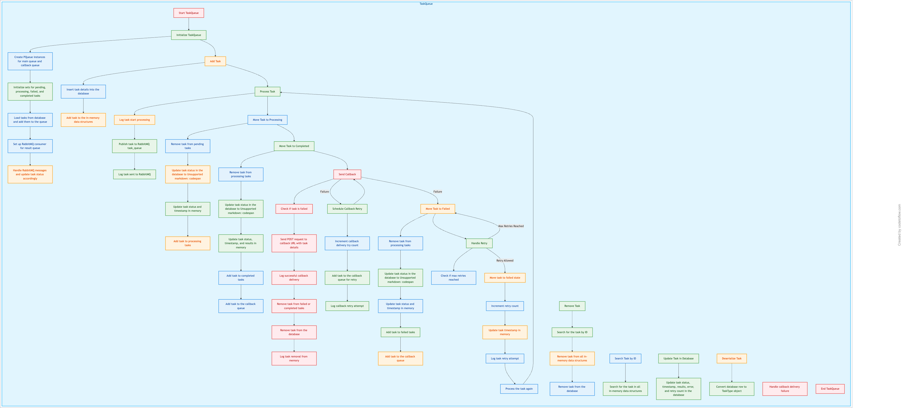

### Cluster and Node Communication

The system uses a clustered architecture for scalability and fault tolerance. The **primary node** manages and monitors worker nodes, ensuring efficient task distribution and execution:

- **Dynamic Worker Management**: The cluster dynamically spawns or kills worker processes based on the workload.
- **Fault Tolerance**: If a worker crashes, the primary node forks a new one to maintain cluster health.
- **RabbitMQ for Communication**: Tasks are distributed to workers via RabbitMQ queues.

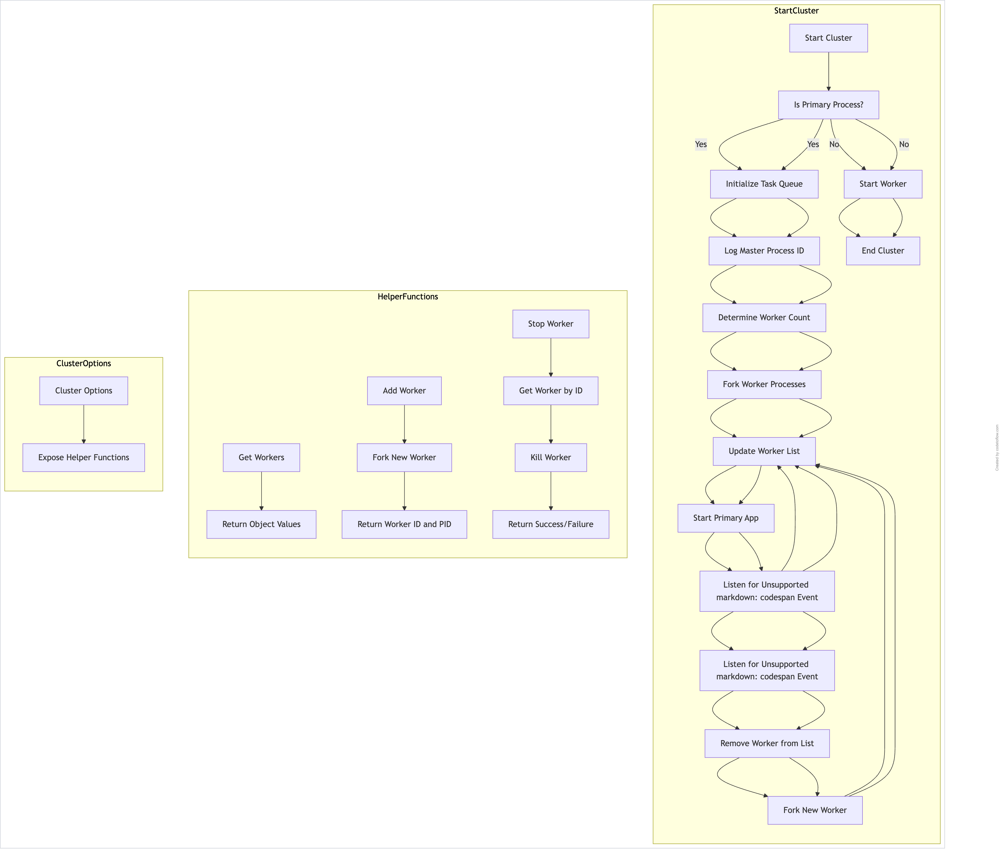

### Image Conversion Service

The image conversion service uses **Sharp**, a high-performance image processing library, to efficiently convert images into the **WebP** format. WebP is a modern image format that provides superior compression and quality compared to older formats like JPEG and PNG. It is ideal for web and mobile applications due to its smaller file sizes and ability to retain image clarity.

#### Conversion Details:

- **Input Format**: Supports various image formats, including JPEG, PNG, and others.
- **Output Format**: Converts all images to WebP for optimized storage and web performance.
- **Resolutions Generated**:
  - **Large**: 1920px wide, quality 80 – suitable for high-resolution displays or hero images.
  - **Medium**: 1280px wide, quality 70 – ideal for medium-sized displays or inline content.
  - **Small**: 640px wide, quality 60 – optimized for mobile or low-bandwidth scenarios.
  - **Extra-Small**: 320px wide, quality 50 – tailored for thumbnails or previews.

#### Benefits of WebP:

- **Efficient Compression**: Significantly smaller file sizes compared to JPEG and PNG, reducing bandwidth usage.
- **High Quality**: Retains visual clarity even at higher compression levels.
- **Web Compatibility**: Widely supported by modern browsers, making it an excellent choice for web applications.
- **Speed**: Improves page load times by reducing image sizes without sacrificing quality.

By generating multiple resolutions, the service ensures that the most appropriate image size is available for different devices and use cases, improving user experience and performance.

### Video Conversion Service

The video conversion service processes videos into **HLS (HTTP Live Streaming)** format, optimized for adaptive streaming on various network speeds, including slower connections. It uses **FFmpeg** with the following configuration:

- **Video Options**:

  - Encodes video using the `libx264` codec, ensuring high compression efficiency and compatibility with most modern streaming players.
  - The `-map 0:v?` option maps all video streams from the input file.
  - Video bitrates and resolutions are configured for three qualities:
    - **720p** @ 1500 kbps
    - **480p** @ 800 kbps
    - **360p** @ 500 kbps

- **Audio Options**:

  - Encodes audio using the `aac` codec for high-quality audio with low bandwidth usage.
  - The `-b:a 96k` option sets the audio bitrate to 96 kbps.

- **HLS Streaming Options**:
  - The videos are split into small segments using `-hls_time 10`, which defines a segment duration of 10 seconds.
  - The `-hls_playlist_type vod` option ensures that the generated playlist (`.m3u8` file) is suitable for video-on-demand streaming.
  - HLS segments are optimized with additional settings:
    - `-maxrate` and `-bufsize` to manage peak bitrates and buffer sizes for smooth streaming.
    - `-hls_segment_filename` to generate `.ts` segment files for each quality level.

This configuration ensures that the output videos are **optimized for streaming**, even on slow or unreliable networks. The adaptive nature of HLS allows players to switch between quality levels dynamically based on the user's available bandwidth, ensuring minimal buffering and a better user experience.

## Admin Panel

The Admin Panel provides a user-friendly interface for monitoring, managing, and debugging the Video and Image Conversion Service. It includes several key features to ensure smooth operation and transparency:

### Features

### 1. **Login**:

- Secured access to the admin panel using basic authentication.
- Only authorized users can access system metrics and controls.
  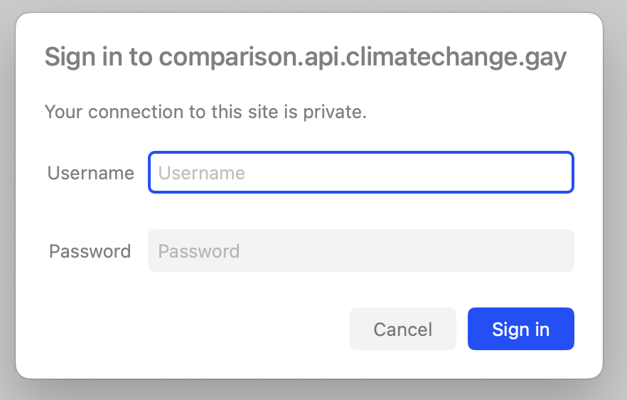

### 2. **Home Dashboard**:

- Provides quick links to detailed views such as logs, monitoring, and cluster management.

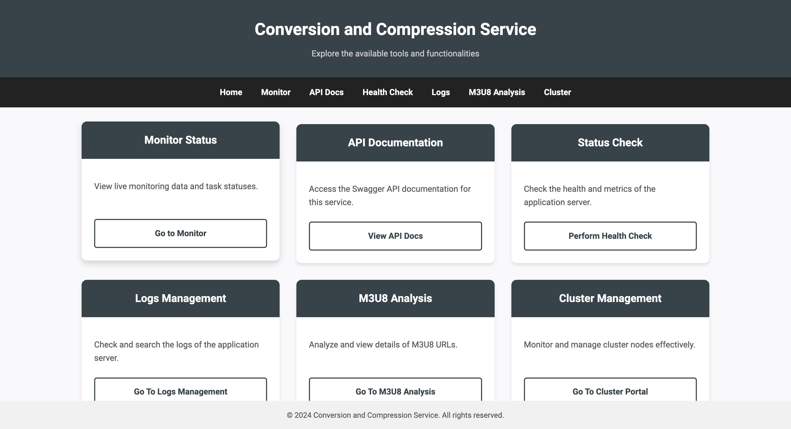

### 3. **Real-Time Tasks Monitoring**:

- View task queues (pending, processing, completed, failed) with tasks details.
- Provides ability to dynamically increase or decrease Concurrency Limit.
- Provides functionality to manually removed completed or failed tasks.

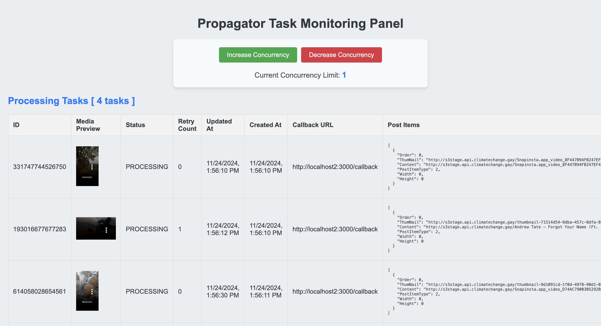

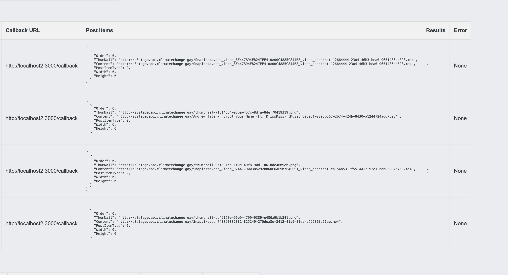

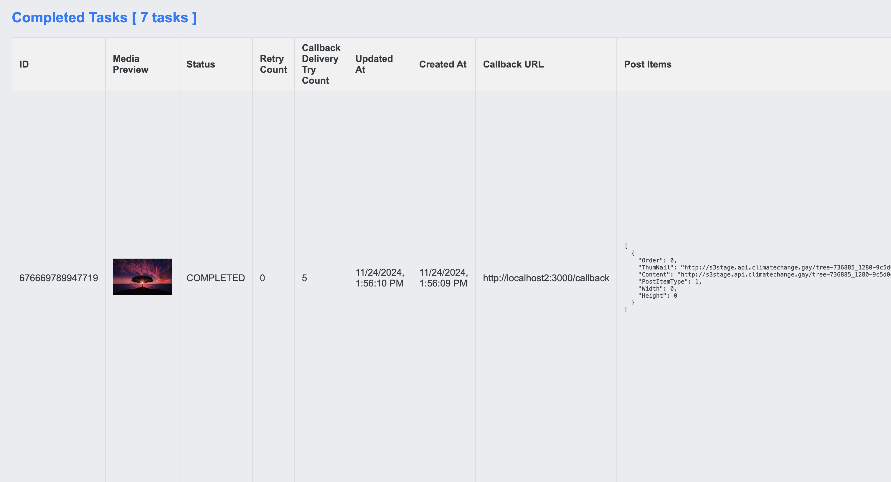

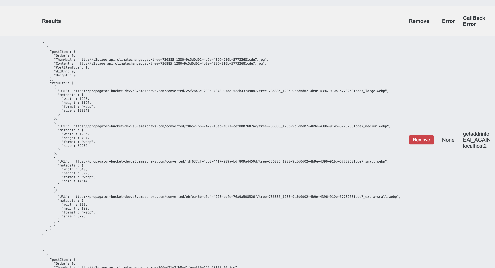

### 4. **API Documentation**:

- Interactive Swagger-based API documentation for all endpoints in the service.
- Provides details about request and response formats, including required parameters and example payloads.
- Accessible from the Admin Panel for quick reference and testing.
- Automatically generated from the `swagger.yaml` file in the project root.

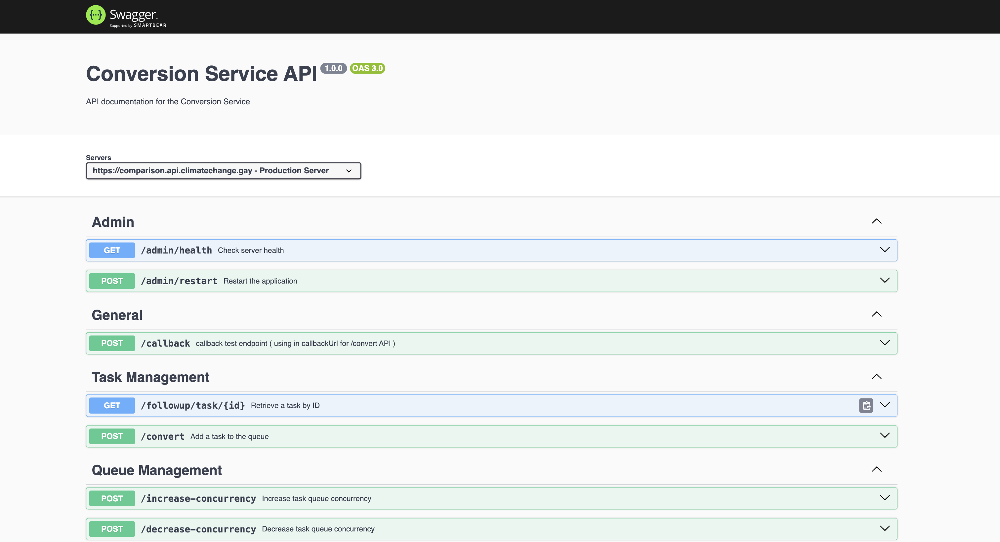

### 5. **Real-Time Server Metrics**:

- A dedicated page displaying real-time server metrics, including:
  - CPU and memory usage.
  - Request per second (RPS) and response times.
  - Active WebSocket connections and event loops.
- Useful for diagnosing server performance issues and understanding resource utilization.
- Automatically updates with real-time data for better visibility into server health.

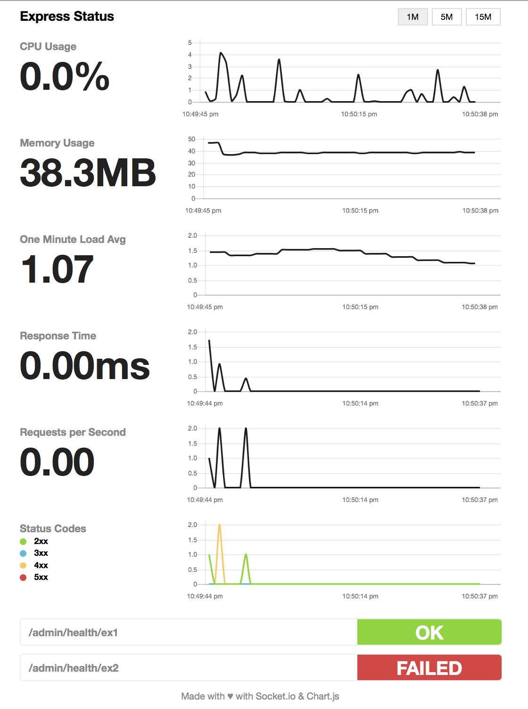

### 6. **Logs Management**:

- Access application logs for debugging and analysis.
- Supports structured logs created by the Winston logger with DailyRotateFile support.

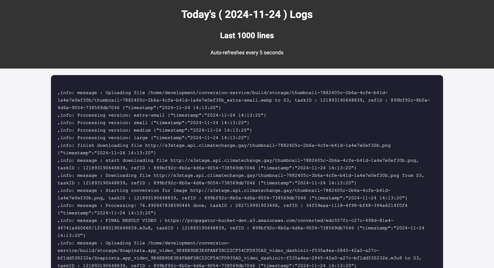

### 7. **M3U8 Analysis**:

- Analyze streaming URLs or HLS playlists.
- Displays metadata and quality details for M3U8 files.
- Useful for debugging or verifying video stream outputs.


### 8. **Cluster Management**:

- Manage and monitor worker nodes in the cluster.
- Restart or remove nodes as needed.

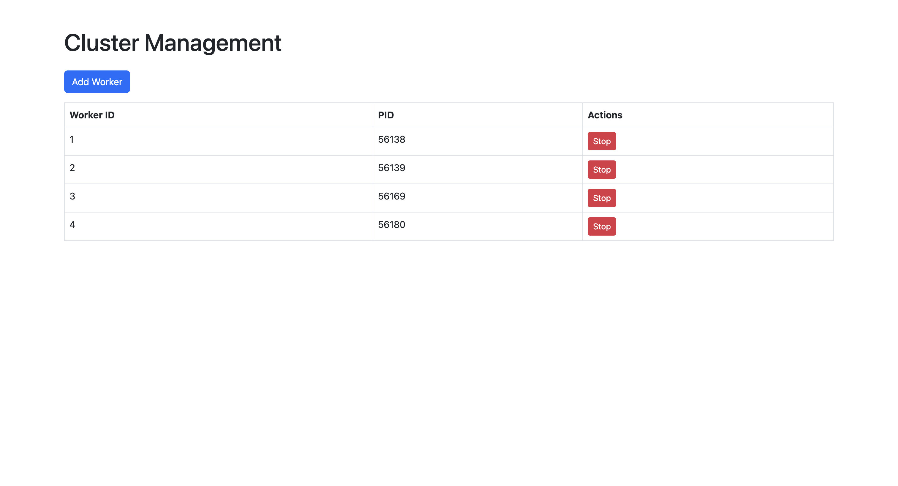

## API Endpoints

Refer to [Swagger documentation](https://comparison.api.climatechange.gay/api-docs/) for detailed API usage.

## Monitoring and Debugging

- Use the Admin Panel to check system health.
- Logs are available in the `logs/` directory.
- For each day there is a log file with YYYY-MM-DD format.

## Frequently Asked Questions (FAQ)

1. **What happens if a task fails?**

   - If a task fails, it is retried based on the configured retry limit in the system. The system logs the failure, and retries are attempted with backoff delays.
   - If the task continues to fail after all retries, it is moved to the "failed" state, and a callback notification is sent to the specified `callbackUrl` (if provided) with the failure details.

2. **Can the system handle large files?**

   - Yes, the system is designed to handle large files efficiently. The architecture supports sequential downloading, processing, and uploading large files without significant performance degradation.

3. **Can the system handle multiple files/high load?**

   - Yes, the system is built to process multiple files concurrently and handle high workloads effectively. Key features include:
     - **Clustered Architecture**: Worker nodes are dynamically spawned to distribute the load across multiple processes.
     - **Task Queue**: Tasks are queued and managed efficiently using an in-memory P-Queue synced with SQLite for persistence.
     - **RabbitMQ**: Facilitates task distribution across worker nodes to prevent bottlenecks.
     - **Retry Mechanism**: Tasks are retried automatically in case of transient failures, ensuring robust handling under high load.

4. **Does the system support task monitoring?**

   - Yes, the Admin Panel provides real-time task monitoring, showing task states (pending, processing, completed, failed) and detailed logs.

5. **How are tasks persisted?**
   - Tasks are stored in an SQLite database, ensuring persistence across system restarts. The in-memory P-Queue synchronizes with the database for high-speed task processing.

## Troubleshooting

- **RabbitMQ connection errors**:

  - Check the following:
    - Ensure the RabbitMQ server is running.
    - Verify RabbitMQ credentials (`RABBITMQ_USER`, `RABBITMQ_PASSWORD`) in the `.env` file.
    - Confirm the RabbitMQ host and port are correctly specified in the `.env` file.
    - Test connectivity to RabbitMQ with a command-line tool or library.

- **AWS S3 upload failures**:

  - Verify the following:
    - The IAM role or user has sufficient permissions (`s3:GetObject`, `s3:PutObject`, etc.).
    - The S3 bucket exists and is properly configured in the `.env` file.
    - Ensure the network connection to S3 is stable.
    - Check for errors in the logs to identify specific upload issues.

- **Task callback notification issues**:

  - If tasks fail to send callback notifications:
    - Ensure the `callbackUrl` provided in the task payload is reachable.
    - Verify the system has internet connectivity to send HTTP requests.
    - Check logs for errors related to callback retries.
    - If using an HTTPS endpoint, ensure the endpoint's SSL/TLS certificate is valid.

- **Task stuck in "processing" state**:

  - Check if the worker processing the task is active and reachable.
  - Verify if the task is causing errors or exceeding resource limits (e.g., memory or CPU usage).
  - Inspect the task logs for details and manually intervene if necessary.

- **Database-related errors**:
  - Ensure the SQLite database file is accessible and not corrupted.
  - Check for file permission issues if the database resides in a shared directory.
  - Restart the application to reinitialize the database connection.

## Conclusion

The Video and Image Conversion Service is a robust and scalable solution for multimedia processing. Its modular architecture, coupled with real-time monitoring, makes it ideal for high-demand environments.
# conversion-services

